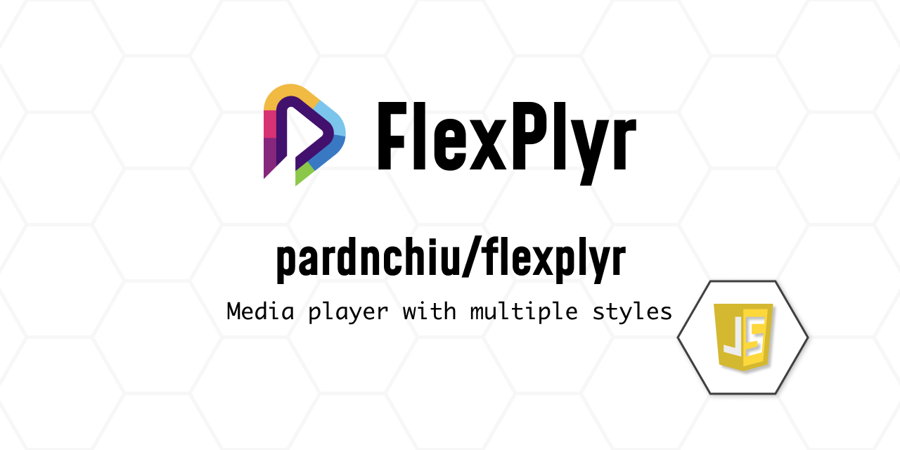
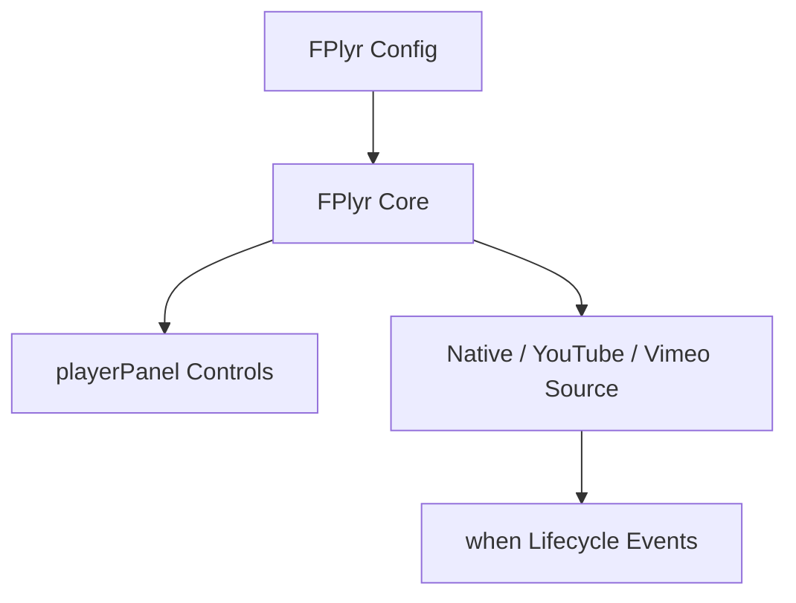

> [!NOTE]
> This README was generated by [SKILL](https://github.com/agenvoy/skill-readme-generate), get the ZH version from [here](./doc/README.zh.md).

***

<picture>

</picture>

<strong>ONE PLAYER FOR HTML5, YOUTUBE AND VIMEO — ZERO DEPENDENCIES</strong>

***

> A lightweight JavaScript library for embeddable HTML5, YouTube, and Vimeo players with themeable panels and full lifecycle events

## Table of Contents

- [Features](#features)
- [Architecture](#architecture)
- [License](#license)
- [Author](#author)

## Features

> `npm i @pardnchiu/flexplyr` · [Documentation](./doc/doc.md)

- **One interface, four sources** — A single `FPlyr` class auto-switches between HTML5 video/audio, YouTube, and Vimeo based on config, with no source-specific handling required by the caller.
- **Four built-in themed panels** — Minimal, Classic, Retro, and Simple panel styles, with freely composable control buttons (play, progress, volume, rate, fullscreen).
- **Zero dependencies, native-API driven** — YouTube/Vimeo SDKs load on demand only when needed; everything else runs on native browser APIs for a tiny footprint.
- **Full lifecycle events** — `ready`, `playing`, `pause`, `end`, and `destroyed` callbacks make it easy to hook into external logic.
- **Mobile-aware fullscreen handling** — A dedicated fullscreen player instance handles `playsinline` and fullscreen state transitions on mobile devices.

## Architecture

> [Full Architecture](./doc/architecture.md)

## License

This project is licensed under the [MIT LICENSE](LICENSE).

## Author

<h4 style="padding-top: 0">邱敬幃 Pardn Chiu</h4>

<a href="mailto:hi@pardn.io">hi@pardn.io</a> 
<a href="https://www.linkedin.com/in/pardnchiu">https://www.linkedin.com/in/pardnchiu</a>

***

©️ 2024 [邱敬幃 Pardn Chiu](https://www.linkedin.com/in/pardnchiu)
