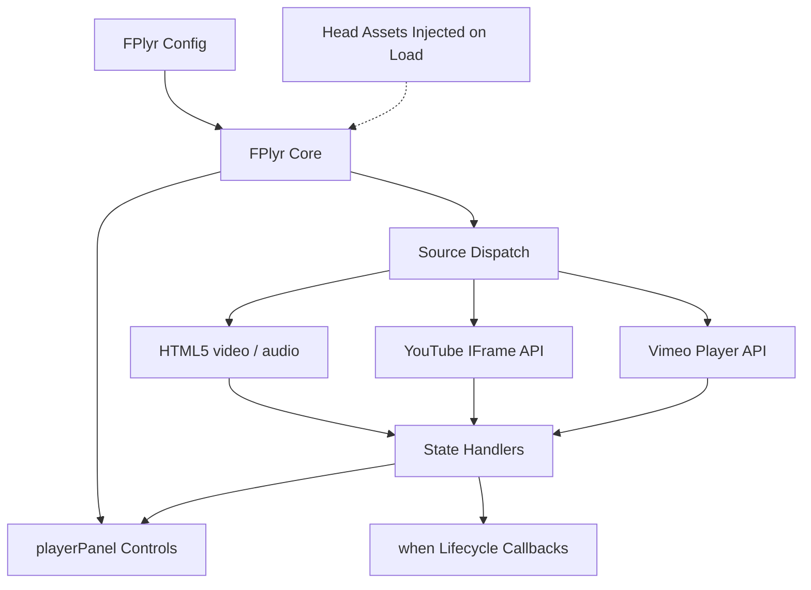

> [!NOTE]
> This README was generated by [SKILL](https://github.com/agenvoy/skill-readme-generate), get the ZH version from [here](./doc/README.zh.md).

***

<strong>ONE PLAYER API FOR HTML5, YOUTUBE AND VIMEO</strong>

***

> A JavaScript player library with unified HTML5/YouTube/Vimeo sources, themed control panels, and lifecycle events

## Table of Contents

- [Features](#features)
- [Architecture](#architecture)
- [License](#license)
- [Author](#author)

## Features

> `npm i @pardnchiu/flexplyr` · [Documentation](./doc/doc.md)

- **Four sources, one interface** — A single `FPlyr` config object drives HTML5 video, audio, YouTube, and Vimeo, so play, pause, volume, and speed behave identically for the caller.
- **Four composable panel themes** — Minimal, Classic, Retro, and Simple panels ship built in, and eight control items can be picked and ordered freely.
- **One script tag to go live** — On load it injects the stylesheet, Material Symbols icons, and the YouTube/Vimeo SDKs, so no build step or extra includes are needed.
- **Full lifecycle events** — Five callbacks (`ready`, `playing`, `pause`, `end`, `destroyed`) make it easy to hook in external logic and clean up resources.
- **Synced mobile fullscreen** — A hidden dedicated fullscreen player takes over on mobile and syncs progress, volume, and speed on entry and exit.

## Architecture

> [Full Architecture](./doc/architecture.md)

```mermaid
graph TB
    A[FPlyr Config] --> B[FPlyr Core]
    H[Head Assets Injected on Load] -.-> B
    B --> C[Source Dispatch]
    C --> D[HTML5 video / audio]
    C --> E[YouTube IFrame API]
    C --> F[Vimeo Player API]
    B --> G[playerPanel Controls]
    D & E & F --> I[State Handlers]
    I --> G
    I --> J[when Lifecycle Callbacks]
```

## License

This project is licensed under the [MIT LICENSE](LICENSE).

## Author

Just [open an issue](https://github.com/pardnchiu/FlexPlyr/issues/new) to share an idea.

***

©️ 2024 [邱敬幃 Pardn Chiu](https://www.linkedin.com/in/pardnchiu)
