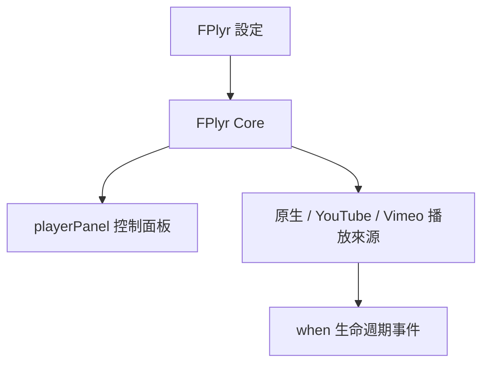

> [!NOTE]
> 此 README 由 [SKILL](https://github.com/agenvoy/skill-readme-generate) 生成，英文版請參閱 [這裡](../README.md)。

***

<picture>

</picture>

<strong>ONE PLAYER FOR HTML5, YOUTUBE AND VIMEO — ZERO DEPENDENCIES</strong>

***

> 輕量 JavaScript 播放器函式庫，統一支援 HTML5、YouTube 與 Vimeo 播放來源，具備主題化控制面板與完整生命週期事件

## 目錄

- [功能特點](#功能特點)
- [架構](#架構)
- [授權](#授權)
- [Author](#author)

## 功能特點

> `npm i @pardnchiu/flexplyr` · [完整文件](./doc.zh.md)

- **單一介面統一四種來源** — 同一個 `FPlyr` class 依傳入設定自動切換 HTML5 影片／音訊、YouTube、Vimeo，呼叫端無需分別處理。
- **四種內建主題面板** — Minimal、Classic、Retro、Simple 四種面板風格，控制按鈕（播放、進度、音量、速度、全螢幕）可自由組合顯示。
- **零依賴、原生 API 驅動** — 僅在需要時才動態載入 YouTube／Vimeo SDK，其餘完全基於瀏覽器原生 API，體積輕巧。
- **完整生命週期事件** — 提供 `ready`、`playing`、`pause`、`end`、`destroyed` 事件回調，方便串接外部邏輯。
- **行動裝置全螢幕處理** — 針對行動裝置另建獨立全螢幕播放器實例，處理 `playsinline` 與全螢幕狀態切換等邊界情況。

## 架構

> [完整架構](./architecture.zh.md)

## 授權

本專案採用 [MIT LICENSE](../LICENSE)。

## Author

<h4 style="padding-top: 0">邱敬幃 Pardn Chiu</h4>

<a href="mailto:hi@pardn.io">hi@pardn.io</a> 
<a href="https://www.linkedin.com/in/pardnchiu">https://www.linkedin.com/in/pardnchiu</a>

***

©️ 2024 [邱敬幃 Pardn Chiu](https://www.linkedin.com/in/pardnchiu)
