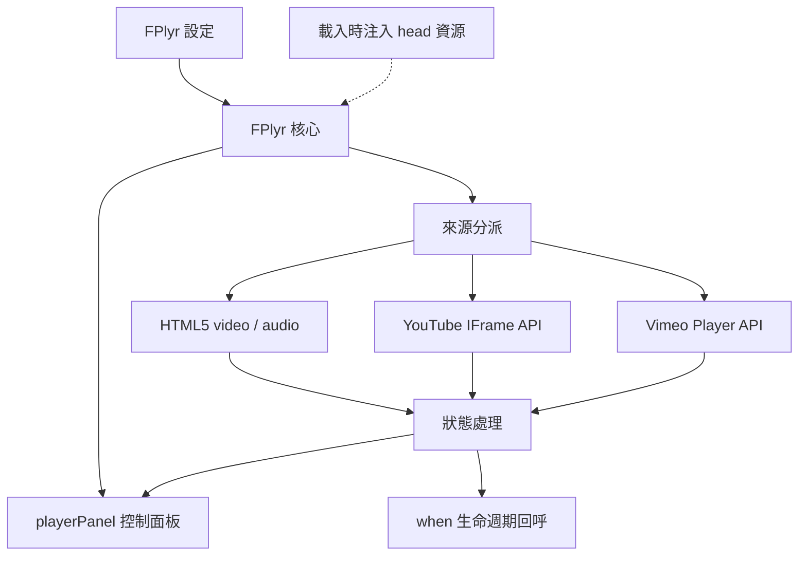

> [!NOTE]
> 此 README 由 [SKILL](https://github.com/agenvoy/skill-readme-generate) 生成，英文版請參閱 [這裡](../README.md)。

***

<strong>ONE PLAYER API FOR HTML5, YOUTUBE AND VIMEO</strong>

***

> JavaScript 播放器函式庫，具備 HTML5／YouTube／Vimeo 統一來源、多風格控制面板與生命週期事件

## 目錄

- [功能特點](#功能特點)
- [架構](#架構)
- [授權](#授權)
- [Author](#author)

## 功能特點

> `npm i @pardnchiu/flexplyr` · [完整文件](./doc.zh.md)

- **四種來源一個介面** — 以同一個 `FPlyr` 設定物件驅動 HTML5 影片、音訊、YouTube 與 Vimeo，播放、暫停、音量、倍速操作對呼叫端完全一致。
- **四種面板風格自由組裝** — 內建 minimal、classic、retro、simple 四種面板，八種控制元件可依需求挑選與排序。
- **單一 script 即可上線** — 載入時自動注入樣式表、Material Symbols 圖示與 YouTube／Vimeo SDK，無需建置流程或額外引入。
- **完整生命週期事件** — `ready`、`playing`、`pause`、`end`、`destroyed` 五個回呼，方便串接外部邏輯與資源回收。
- **行動裝置全螢幕同步** — 以隱藏的專用全螢幕播放器接手播放，進出全螢幕時自動同步進度、音量與倍速。

## 架構

> [完整架構](./architecture.zh.md)

```mermaid
graph TB
    A[FPlyr 設定] --> B[FPlyr 核心]
    H[載入時注入 head 資源] -.-> B
    B --> C[來源分派]
    C --> D[HTML5 video / audio]
    C --> E[YouTube IFrame API]
    C --> F[Vimeo Player API]
    B --> G[playerPanel 控制面板]
    D & E & F --> I[狀態處理]
    I --> G
    I --> J[when 生命週期回呼]
```

## 授權

本專案採用 [MIT LICENSE](../LICENSE)。

## Author

Just [open an issue](https://github.com/pardnchiu/FlexPlyr/issues/new) to share an idea.

***

©️ 2024 [邱敬幃 Pardn Chiu](https://www.linkedin.com/in/pardnchiu)
