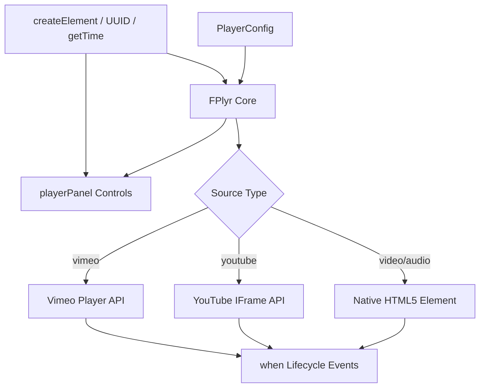
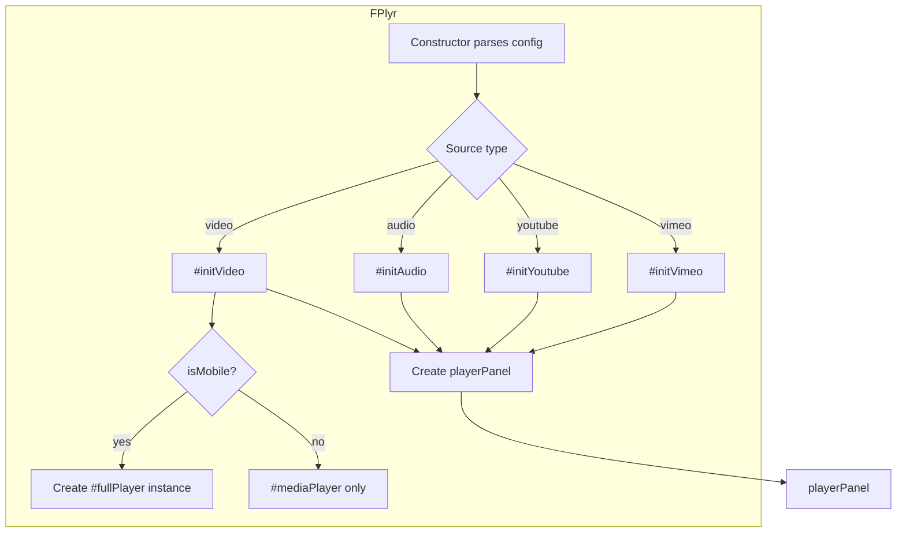
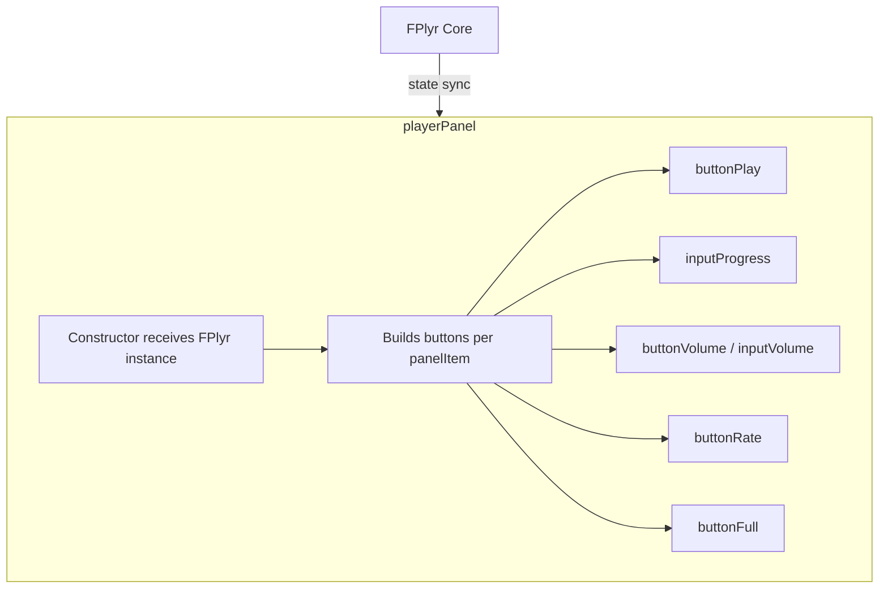
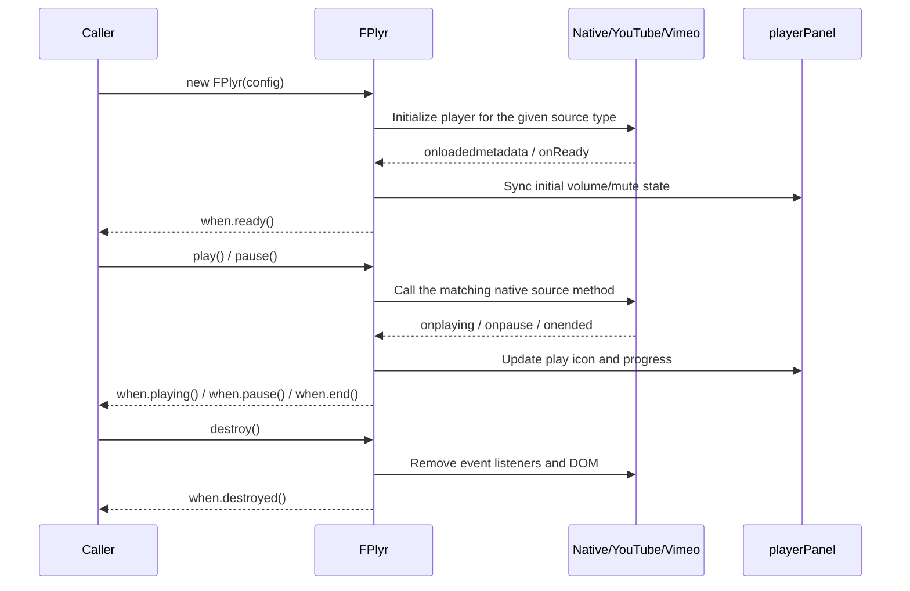
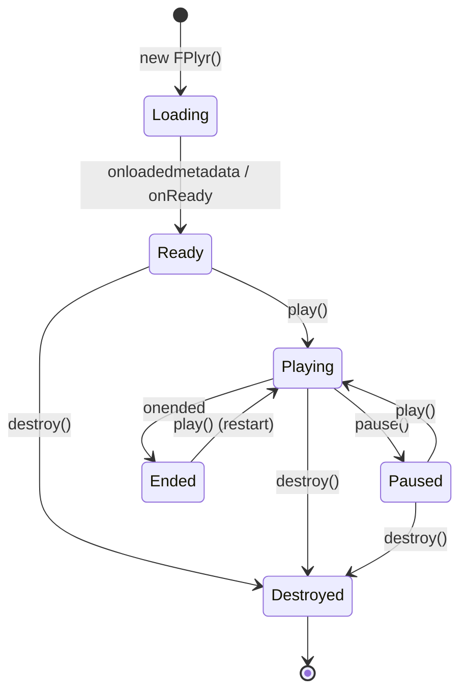

# FlexPlyr - Architecture

> Back to [README](../README.md)

## Overview

## Module: FPlyr Core (`src/js/model/player.js`)

Parses `PlayerConfig`, initializes the matching playback logic for the given source type, and exposes a unified `play` / `pause` / `isPaused` / `isMuted` / `destroy` API. On mobile devices it also maintains a separate fullscreen player instance.

## Module: playerPanel (`src/js/model/playerPanel.js`)

Assembles the control panel DOM (play button, progress bar, volume, rate, fullscreen) based on `option.panelType` and `option.panelItem`, and exposes `setPlayIcon` / `setVolume` / `setMuteIcon` / `setCurrent` / `duration` for FPlyr Core to keep the UI in sync.

## Module: Shared Utilities (`src/js/function/*.js`)

| Function | Responsibility |
|------|------|
| `createElement` | Builds a DOM element from CSS-selector syntax (`tag.class#id`) and applies attributes/children |
| `UUID` | Generates a unique random string, used for cases like the YouTube iframe container needing a unique DOM id |
| `getTime` | Formats a second count into a `mm:ss` / `hh:mm:ss` display string |

## Data Flow

## State Machine

***

©️ 2024 [邱敬幃 Pardn Chiu](https://www.linkedin.com/in/pardnchiu)
