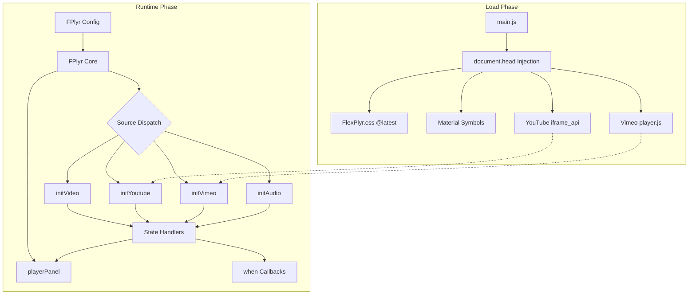
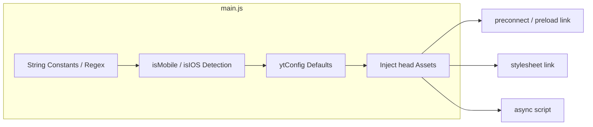
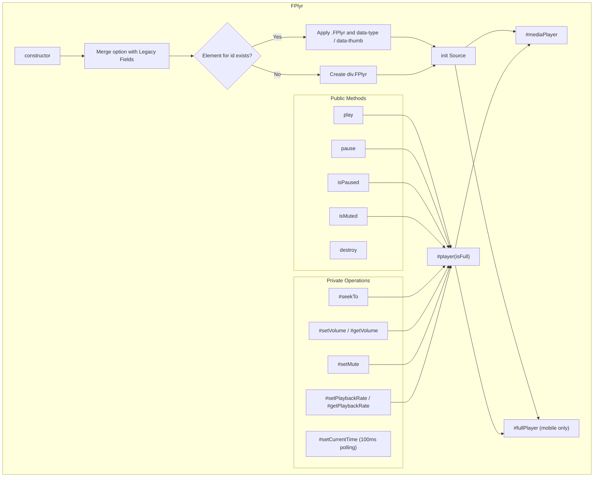
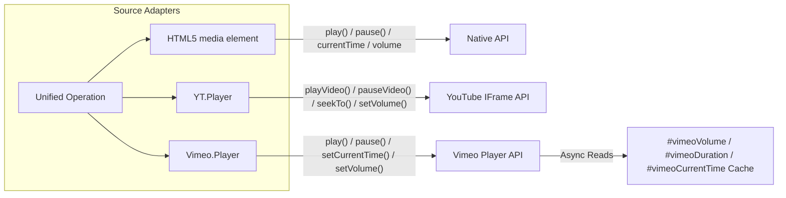
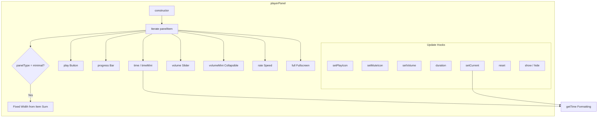
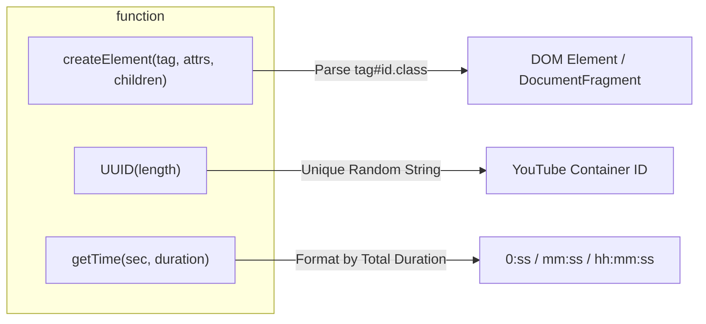
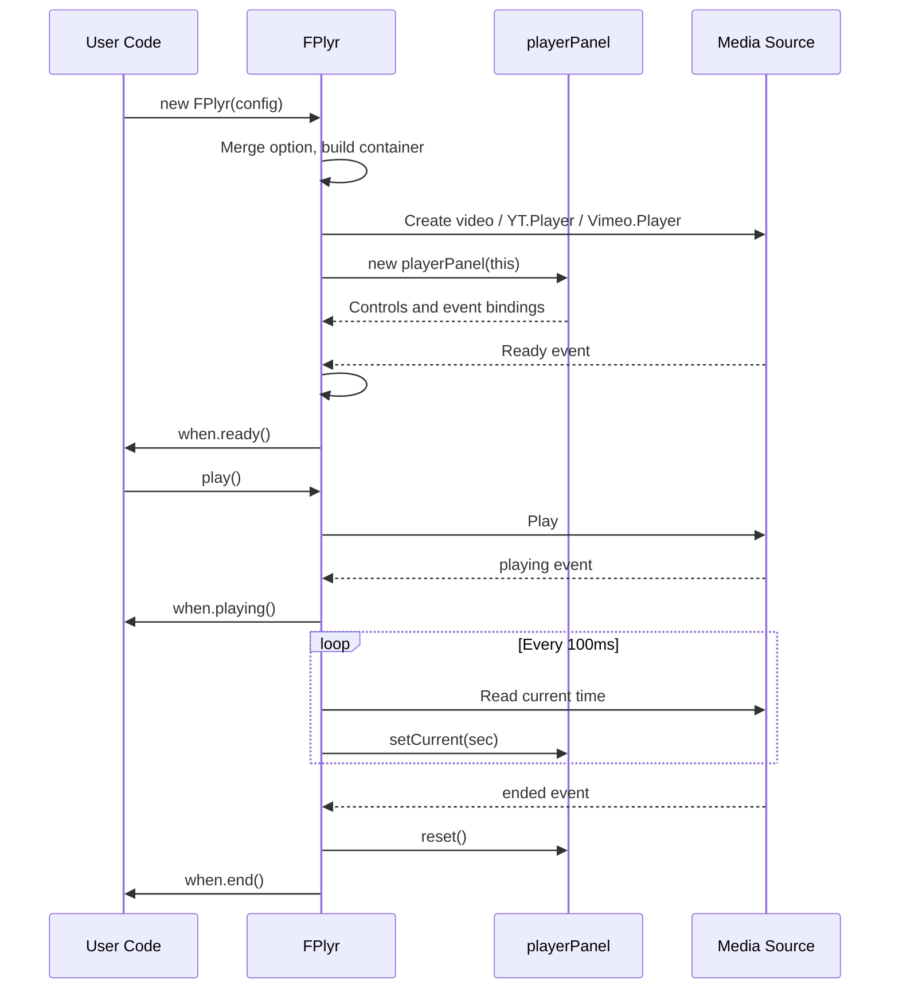
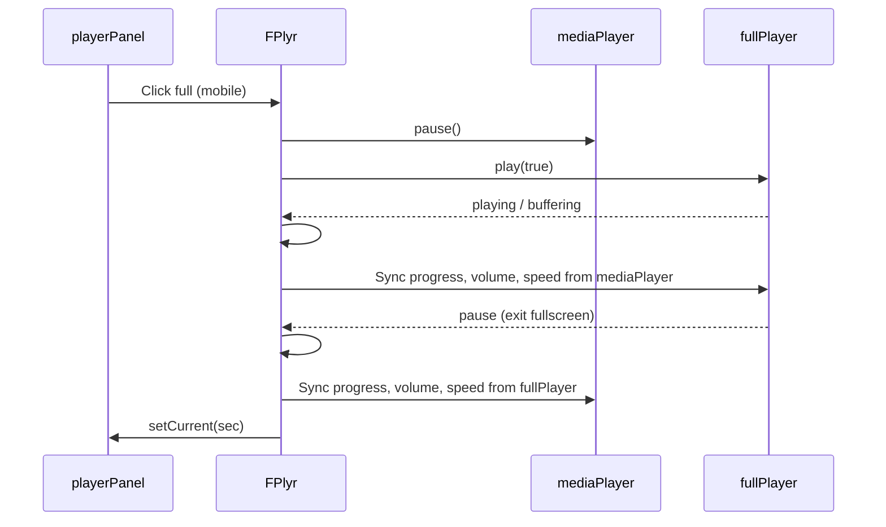
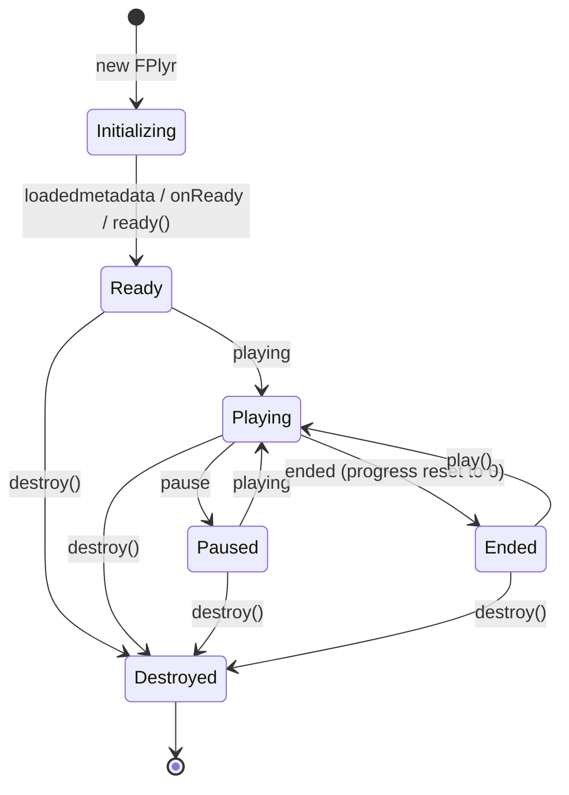

# FlexPlyr - Architecture

> Back to [README](../README.md)

## Overview

```mermaid
graph TB
    subgraph Load Phase
        M[main.js] --> HEAD["document.head Injection"]
        HEAD --> CSS[FlexPlyr.css @latest]
        HEAD --> ICON[Material Symbols]
        HEAD --> YTSDK[YouTube iframe_api]
        HEAD --> VMSDK[Vimeo player.js]
    end

    subgraph Runtime Phase
        CFG[FPlyr Config] --> CORE[FPlyr Core]
        CORE --> DISPATCH{Source Dispatch}
        DISPATCH --> V[initVideo]
        DISPATCH --> Y[initYoutube]
        DISPATCH --> VM[initVimeo]
        DISPATCH --> A[initAudio]
        CORE --> PANEL[playerPanel]
        V & Y & VM & A --> STATE[State Handlers]
        STATE --> PANEL
        STATE --> WHEN[when Callbacks]
    end

    YTSDK -.-> Y
    VMSDK -.-> VM
```

## Module: Bootstrap (main.js)

Declares shared constants, detects mobile devices, and injects external assets into `<head>` once at module load.

```mermaid
graph LR
    subgraph main.js
        CONST[String Constants / Regex] --> DETECT[isMobile / isIOS Detection]
        DETECT --> YTCFG[ytConfig Defaults]
        YTCFG --> INJECT[Inject head Assets]
    end
    INJECT --> PRE[preconnect / preload link]
    INJECT --> STYLE[stylesheet link]
    INJECT --> SCRIPT[async script]
```

## Module: FPlyr Core (player.js)

Parses config, builds the container, initializes the player per source, and wraps the four sources' differences behind unified methods.

```mermaid
graph TB
    subgraph FPlyr
        CTOR[constructor] --> MERGE[Merge option with Legacy Fields]
        MERGE --> BODY{Element for id exists?}
        BODY -->|Yes| ATTACH[Apply .FPlyr and data-type / data-thumb]
        BODY -->|No| CREATE[Create div.FPlyr]
        ATTACH & CREATE --> INIT[init Source]

        INIT --> MP["#mediaPlayer"]
        INIT --> FP["#fullPlayer (mobile only)"]

        PICK["#player(isFull)"] --> MP
        PICK --> FP

        subgraph Public Methods
            PLAY[play]
            PAUSE[pause]
            ISP[isPaused]
            ISM[isMuted]
            DES[destroy]
        end

        subgraph Private Operations
            SEEK["#seekTo"]
            VOL["#setVolume / #getVolume"]
            MUTE["#setMute"]
            RATE["#setPlaybackRate / #getPlaybackRate"]
            TIMER["#setCurrentTime (100ms polling)"]
        end

        PLAY & PAUSE & ISP & ISM --> PICK
        SEEK & VOL & MUTE & RATE --> PICK
    end
```

## Module: Source Adapters

Each source maps to a different underlying API; the core routes calls via the `#isVideo`/`#isAudio`/`#isYoutube`/`#isVimeo` flags.

```mermaid
graph LR
    subgraph Source Adapters
        OP[Unified Operation] --> H5[HTML5 media element]
        OP --> YT[YT.Player]
        OP --> VMO[Vimeo.Player]
    end
    H5 -->|"play() / pause() / currentTime / volume"| N[Native API]
    YT -->|"playVideo() / pauseVideo() / seekTo() / setVolume()"| YTAPI[YouTube IFrame API]
    VMO -->|"play() / pause() / setCurrentTime() / setVolume()"| VMAPI[Vimeo Player API]
    VMAPI -->|Async Reads| CACHE["#vimeoVolume / #vimeoDuration / #vimeoCurrentTime Cache"]
```

## Module: Control Panel (playerPanel.js)

Builds control items one by one from `panelItem` and exposes update hooks for icons, progress, volume, and visibility.

```mermaid
graph TB
    subgraph playerPanel
        CTOR[constructor] --> LOOP[Iterate panelItem]
        LOOP --> BP[play Button]
        LOOP --> PR[progress Bar]
        LOOP --> TM[time / timeMini]
        LOOP --> VO[volume Slider]
        LOOP --> VM[volumeMini Collapsible]
        LOOP --> RT[rate Speed]
        LOOP --> FU[full Fullscreen]
        LOOP --> W{panelType = minimal?}
        W -->|Yes| WIDTH[Fixed Width from Item Sum]

        subgraph Update Hooks
            SPI[setPlayIcon]
            SMI[setMuteIcon]
            SV[setVolume]
            DU[duration]
            SC[setCurrent]
            RS[reset]
            SH[show / hide]
        end
    end
    TM --> GT[getTime Formatting]
    SC --> GT
```

## Module: Helpers

```mermaid
graph LR
    subgraph function
        CE["createElement(tag, attrs, children)"]
        UU["UUID(length)"]
        GT["getTime(sec, duration)"]
    end
    CE -->|Parse tag#id.class| DOM[DOM Element / DocumentFragment]
    UU -->|Unique Random String| YTID[YouTube Container ID]
    GT -->|Format by Total Duration| FMT["0:ss / mm:ss / hh:mm:ss"]
```

## Data Flow

### Initialization and Playback

```mermaid
sequenceDiagram
    participant U as User Code
    participant C as FPlyr
    participant P as playerPanel
    participant S as Media Source
    U->>C: new FPlyr(config)
    C->>C: Merge option, build container
    C->>S: Create video / YT.Player / Vimeo.Player
    C->>P: new playerPanel(this)
    P-->>C: Controls and event bindings
    S-->>C: Ready event
    C->>C: #stateReady: set duration, volume, mute
    C->>U: when.ready()
    U->>C: play()
    C->>S: Play
    S-->>C: playing event
    C->>U: when.playing()
    loop Every 100ms
        C->>S: Read current time
        C->>P: setCurrent(sec)
    end
    S-->>C: ended event
    C->>P: reset()
    C->>U: when.end()
```

### Mobile Fullscreen Handoff

```mermaid
sequenceDiagram
    participant P as playerPanel
    participant C as FPlyr
    participant M as mediaPlayer
    participant F as fullPlayer
    P->>C: Click full (mobile)
    C->>M: pause()
    C->>F: play(true)
    F-->>C: playing / buffering
    C->>C: #stateFullPlaying
    C->>F: Sync progress, volume, speed from mediaPlayer
    F-->>C: pause (exit fullscreen)
    C->>C: #stateFullPause
    C->>M: Sync progress, volume, speed from fullPlayer
    C->>P: setCurrent(sec)
```

## State Machine

```mermaid
stateDiagram-v2
    [*] --> Initializing: new FPlyr
    Initializing --> Ready: loadedmetadata / onReady / ready()
    Ready --> Playing: playing
    Playing --> Paused: pause
    Paused --> Playing: playing
    Playing --> Ended: ended (progress reset to 0)
    Ended --> Playing: play()
    Ready --> Destroyed: destroy()
    Playing --> Destroyed: destroy()
    Paused --> Destroyed: destroy()
    Ended --> Destroyed: destroy()
    Destroyed --> [*]
```

***

©️ 2024 [邱敬幃 Pardn Chiu](https://www.linkedin.com/in/pardnchiu)
