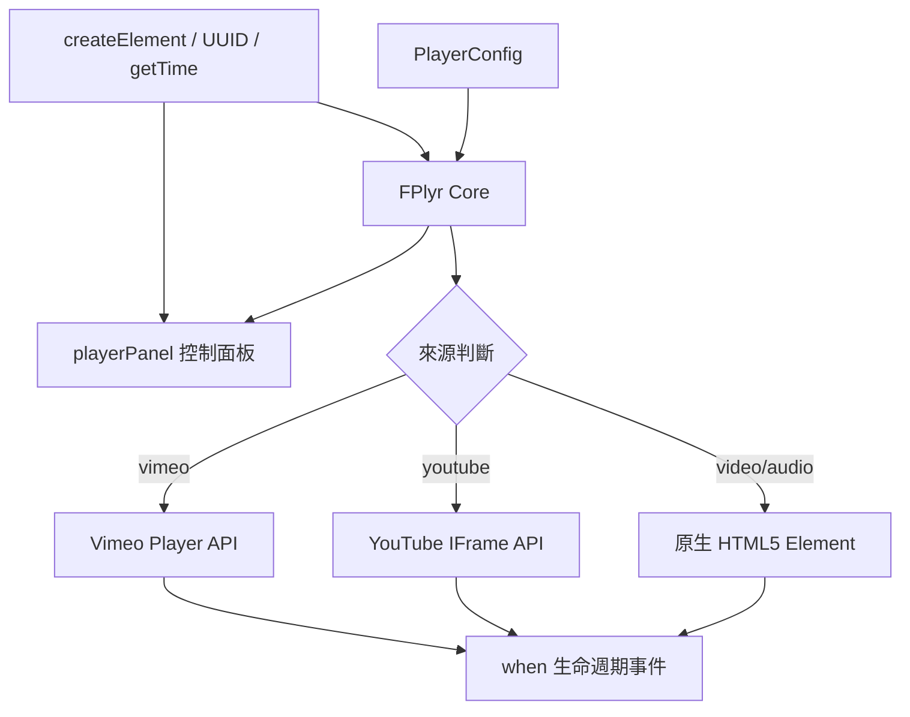
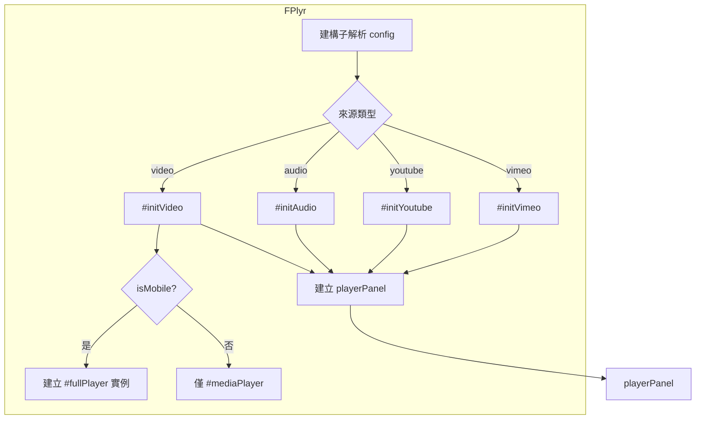
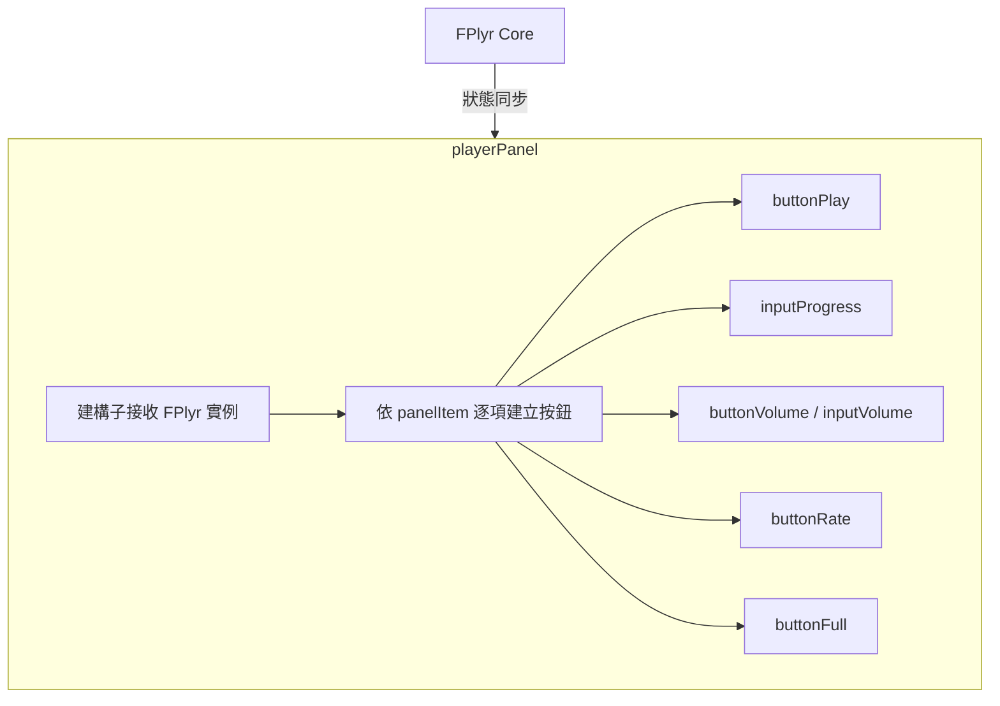
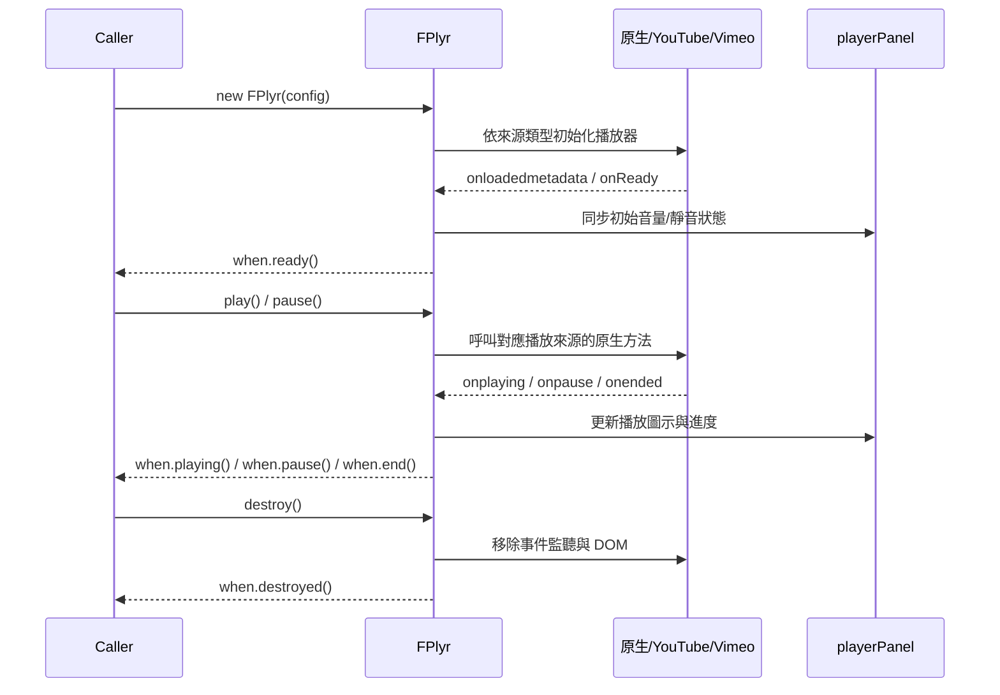
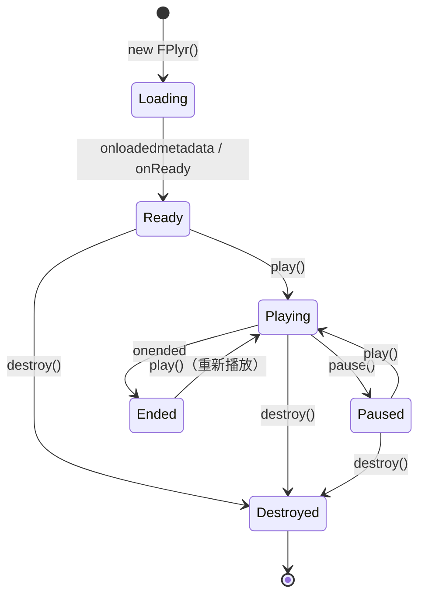

# FlexPlyr - 架構

> 返回 [README](./README.zh.md)

## 概覽

## 模組：FPlyr Core（`src/js/model/player.js`）

負責解析 `PlayerConfig`、依來源類型初始化對應播放邏輯、統一對外暴露 `play` / `pause` / `isPaused` / `isMuted` / `destroy` 等方法，並在行動裝置上維護一組獨立的全螢幕播放器實例。

## 模組：playerPanel（`src/js/model/playerPanel.js`）

依 `option.panelType` 與 `option.panelItem` 動態組裝控制面板 DOM（播放鍵、進度條、音量、速度、全螢幕按鈕），並提供 `setPlayIcon` / `setVolume` / `setMuteIcon` / `setCurrent` / `duration` 等方法供 FPlyr Core 同步 UI 狀態。

## 模組：共用工具函式（`src/js/function/*.js`）

| 函式 | 職責 |
|------|------|
| `createElement` | 以 CSS selector 語法（`tag.class#id`）建立 DOM 元素並套用屬性／子節點 |
| `UUID` | 產生不重複的隨機字串，供 YouTube iframe 容器等需要唯一 DOM id 的場景使用 |
| `getTime` | 將秒數格式化為 `mm:ss` / `hh:mm:ss` 顯示字串 |

## 資料流

## 狀態機

***

©️ 2024 [邱敬幃 Pardn Chiu](https://www.linkedin.com/in/pardnchiu)
