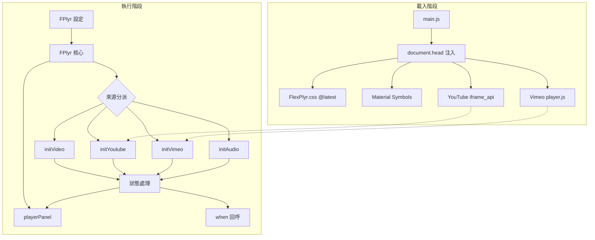
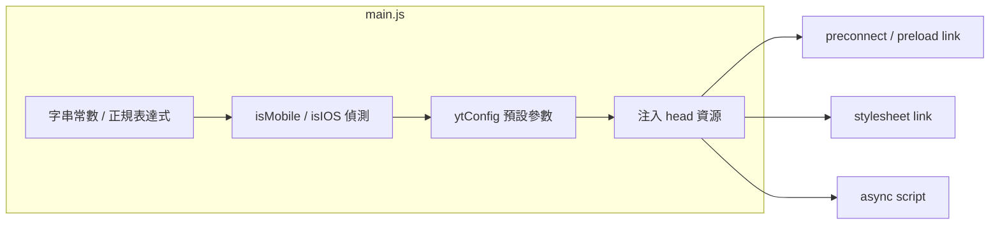
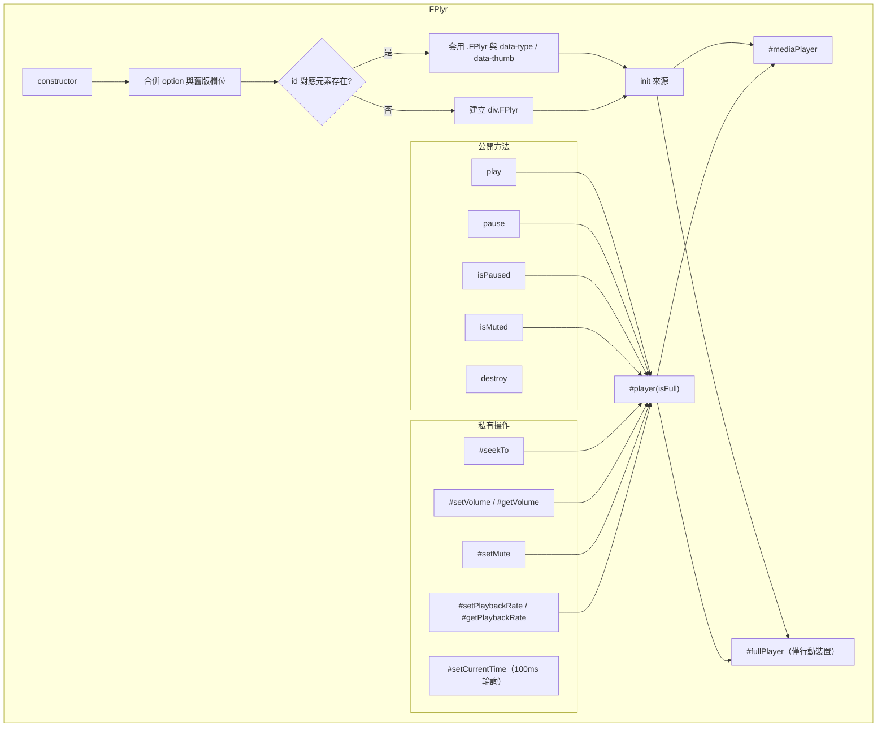
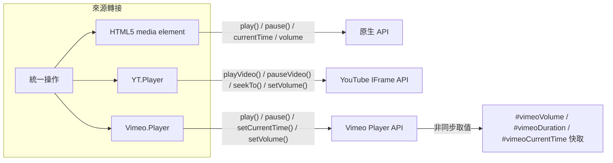
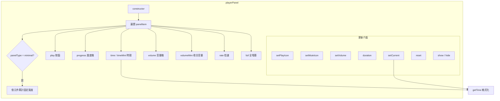
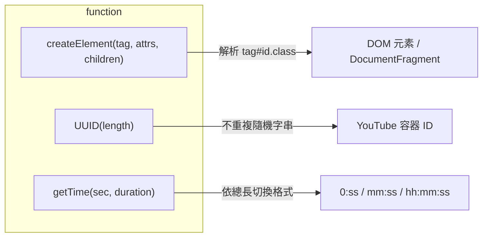
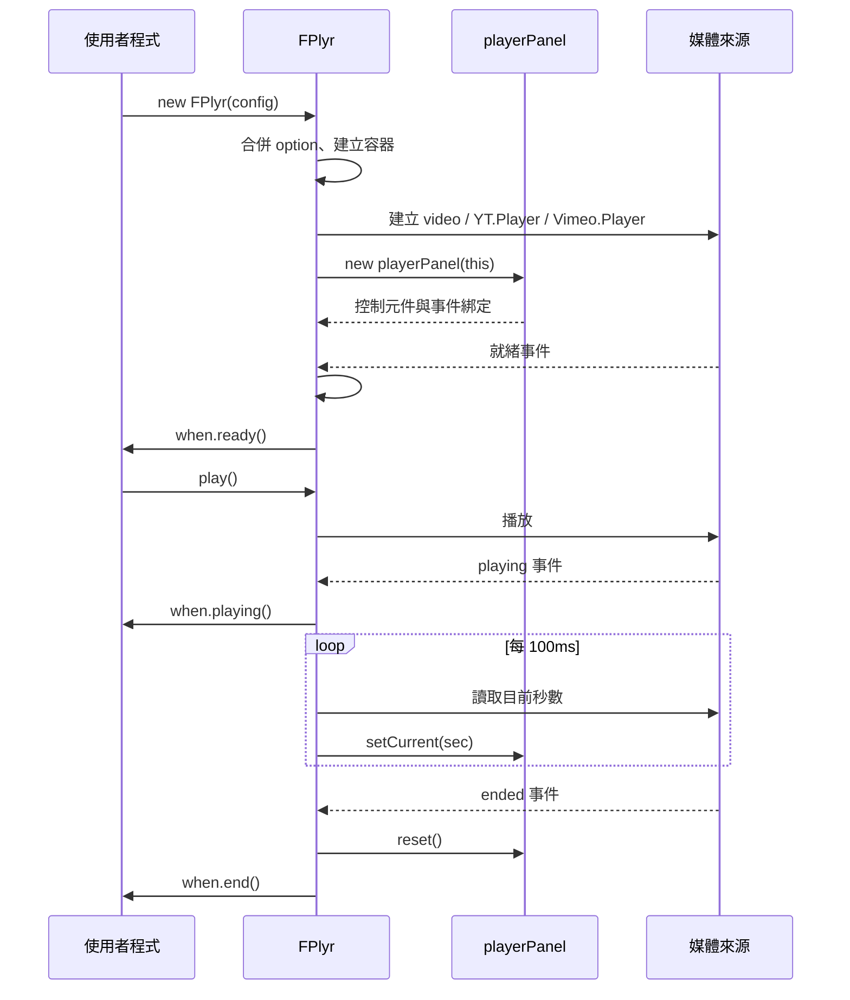
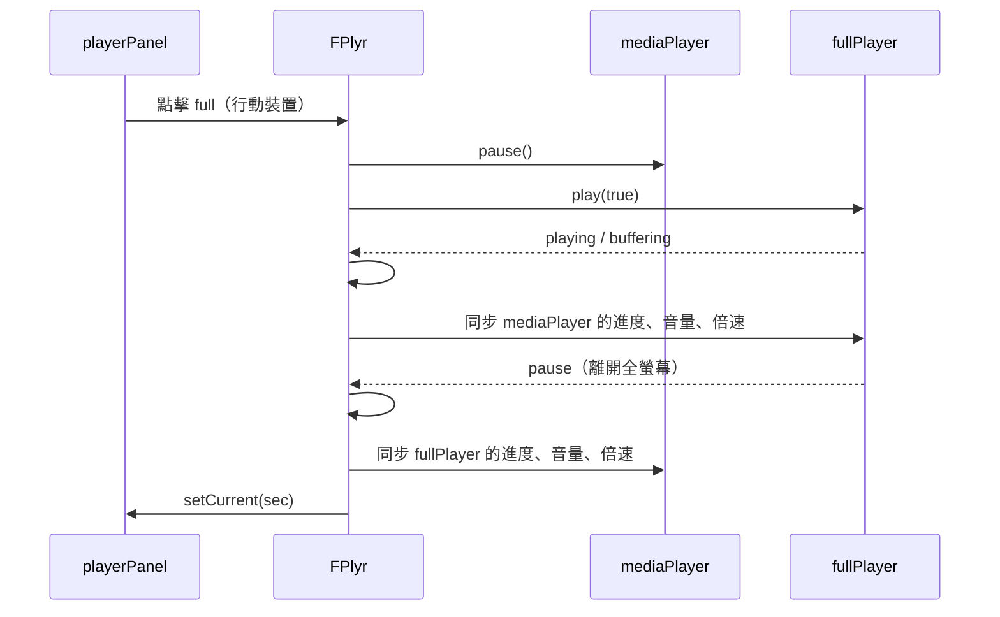
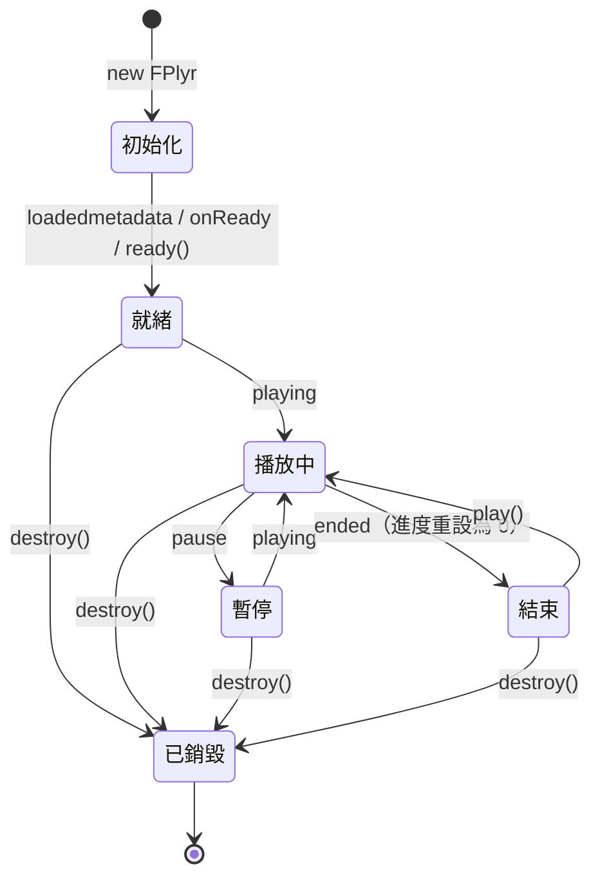

# FlexPlyr - 架構

> 返回 [README](./README.zh.md)

## 概覽

```mermaid
graph TB
    subgraph 載入階段
        M[main.js] --> HEAD["document.head 注入"]
        HEAD --> CSS[FlexPlyr.css @latest]
        HEAD --> ICON[Material Symbols]
        HEAD --> YTSDK[YouTube iframe_api]
        HEAD --> VMSDK[Vimeo player.js]
    end

    subgraph 執行階段
        CFG[FPlyr 設定] --> CORE[FPlyr 核心]
        CORE --> DISPATCH{來源分派}
        DISPATCH --> V[initVideo]
        DISPATCH --> Y[initYoutube]
        DISPATCH --> VM[initVimeo]
        DISPATCH --> A[initAudio]
        CORE --> PANEL[playerPanel]
        V & Y & VM & A --> STATE[狀態處理]
        STATE --> PANEL
        STATE --> WHEN[when 回呼]
    end

    YTSDK -.-> Y
    VMSDK -.-> VM
```

## Module: 載入引導（main.js）

宣告共用常數、偵測行動裝置，並在模組載入時一次性將外部資源注入 `<head>`。

```mermaid
graph LR
    subgraph main.js
        CONST[字串常數 / 正規表達式] --> DETECT[isMobile / isIOS 偵測]
        DETECT --> YTCFG[ytConfig 預設參數]
        YTCFG --> INJECT[注入 head 資源]
    end
    INJECT --> PRE[preconnect / preload link]
    INJECT --> STYLE[stylesheet link]
    INJECT --> SCRIPT[async script]
```

## Module: FPlyr 核心（player.js）

解析設定、建立容器、依來源初始化播放器，並以統一方法封裝四種來源的操作差異。

```mermaid
graph TB
    subgraph FPlyr
        CTOR[constructor] --> MERGE[合併 option 與舊版欄位]
        MERGE --> BODY{id 對應元素存在?}
        BODY -->|是| ATTACH[套用 .FPlyr 與 data-type / data-thumb]
        BODY -->|否| CREATE[建立 div.FPlyr]
        ATTACH & CREATE --> INIT[init 來源]

        INIT --> MP["#mediaPlayer"]
        INIT --> FP["#fullPlayer（僅行動裝置）"]

        PICK["#player(isFull)"] --> MP
        PICK --> FP

        subgraph 公開方法
            PLAY[play]
            PAUSE[pause]
            ISP[isPaused]
            ISM[isMuted]
            DES[destroy]
        end

        subgraph 私有操作
            SEEK["#seekTo"]
            VOL["#setVolume / #getVolume"]
            MUTE["#setMute"]
            RATE["#setPlaybackRate / #getPlaybackRate"]
            TIMER["#setCurrentTime（100ms 輪詢）"]
        end

        PLAY & PAUSE & ISP & ISM --> PICK
        SEEK & VOL & MUTE & RATE --> PICK
    end
```

## Module: 來源轉接

四種來源各自對應不同的底層 API，由核心以 `#isVideo`／`#isAudio`／`#isYoutube`／`#isVimeo` 旗標分流。

```mermaid
graph LR
    subgraph 來源轉接
        OP[統一操作] --> H5[HTML5 media element]
        OP --> YT[YT.Player]
        OP --> VMO[Vimeo.Player]
    end
    H5 -->|"play() / pause() / currentTime / volume"| N[原生 API]
    YT -->|"playVideo() / pauseVideo() / seekTo() / setVolume()"| YTAPI[YouTube IFrame API]
    VMO -->|"play() / pause() / setCurrentTime() / setVolume()"| VMAPI[Vimeo Player API]
    VMAPI -->|非同步取值| CACHE["#vimeoVolume / #vimeoDuration / #vimeoCurrentTime 快取"]
```

## Module: 控制面板（playerPanel.js）

依 `panelItem` 逐一建立控制元件，並提供圖示、進度、音量與顯示／隱藏的更新介面。

```mermaid
graph TB
    subgraph playerPanel
        CTOR[constructor] --> LOOP[遍歷 panelItem]
        LOOP --> BP[play 按鈕]
        LOOP --> PR[progress 進度條]
        LOOP --> TM[time / timeMini 時間]
        LOOP --> VO[volume 音量條]
        LOOP --> VM[volumeMini 收合音量]
        LOOP --> RT[rate 倍速]
        LOOP --> FU[full 全螢幕]
        LOOP --> W{panelType = minimal?}
        W -->|是| WIDTH[依元件累計固定寬度]

        subgraph 更新介面
            SPI[setPlayIcon]
            SMI[setMuteIcon]
            SV[setVolume]
            DU[duration]
            SC[setCurrent]
            RS[reset]
            SH[show / hide]
        end
    end
    TM --> GT[getTime 格式化]
    SC --> GT
```

## Module: 輔助函式

```mermaid
graph LR
    subgraph function
        CE["createElement(tag, attrs, children)"]
        UU["UUID(length)"]
        GT["getTime(sec, duration)"]
    end
    CE -->|解析 tag#id.class| DOM[DOM 元素 / DocumentFragment]
    UU -->|不重複隨機字串| YTID[YouTube 容器 ID]
    GT -->|依總長切換格式| FMT["0:ss / mm:ss / hh:mm:ss"]
```

## 資料流

### 初始化與播放

```mermaid
sequenceDiagram
    participant U as 使用者程式
    participant C as FPlyr
    participant P as playerPanel
    participant S as 媒體來源
    U->>C: new FPlyr(config)
    C->>C: 合併 option、建立容器
    C->>S: 建立 video / YT.Player / Vimeo.Player
    C->>P: new playerPanel(this)
    P-->>C: 控制元件與事件綁定
    S-->>C: 就緒事件
    C->>C: #stateReady：設定時長、音量、靜音
    C->>U: when.ready()
    U->>C: play()
    C->>S: 播放
    S-->>C: playing 事件
    C->>U: when.playing()
    loop 每 100ms
        C->>S: 讀取目前秒數
        C->>P: setCurrent(sec)
    end
    S-->>C: ended 事件
    C->>P: reset()
    C->>U: when.end()
```

### 行動裝置全螢幕切換

```mermaid
sequenceDiagram
    participant P as playerPanel
    participant C as FPlyr
    participant M as mediaPlayer
    participant F as fullPlayer
    P->>C: 點擊 full（行動裝置）
    C->>M: pause()
    C->>F: play(true)
    F-->>C: playing / buffering
    C->>C: #stateFullPlaying
    C->>F: 同步 mediaPlayer 的進度、音量、倍速
    F-->>C: pause（離開全螢幕）
    C->>C: #stateFullPause
    C->>M: 同步 fullPlayer 的進度、音量、倍速
    C->>P: setCurrent(sec)
```

## 狀態機

```mermaid
stateDiagram-v2
    state "初始化" as Init
    state "就緒" as Ready
    state "播放中" as Playing
    state "暫停" as Paused
    state "結束" as Ended
    state "已銷毀" as Destroyed
    [*] --> Init: new FPlyr
    Init --> Ready: loadedmetadata / onReady / ready()
    Ready --> Playing: playing
    Playing --> Paused: pause
    Paused --> Playing: playing
    Playing --> Ended: ended（進度重設為 0）
    Ended --> Playing: play()
    Ready --> Destroyed: destroy()
    Playing --> Destroyed: destroy()
    Paused --> Destroyed: destroy()
    Ended --> Destroyed: destroy()
    Destroyed --> [*]
```

***

©️ 2024 [邱敬幃 Pardn Chiu](https://www.linkedin.com/in/pardnchiu)
